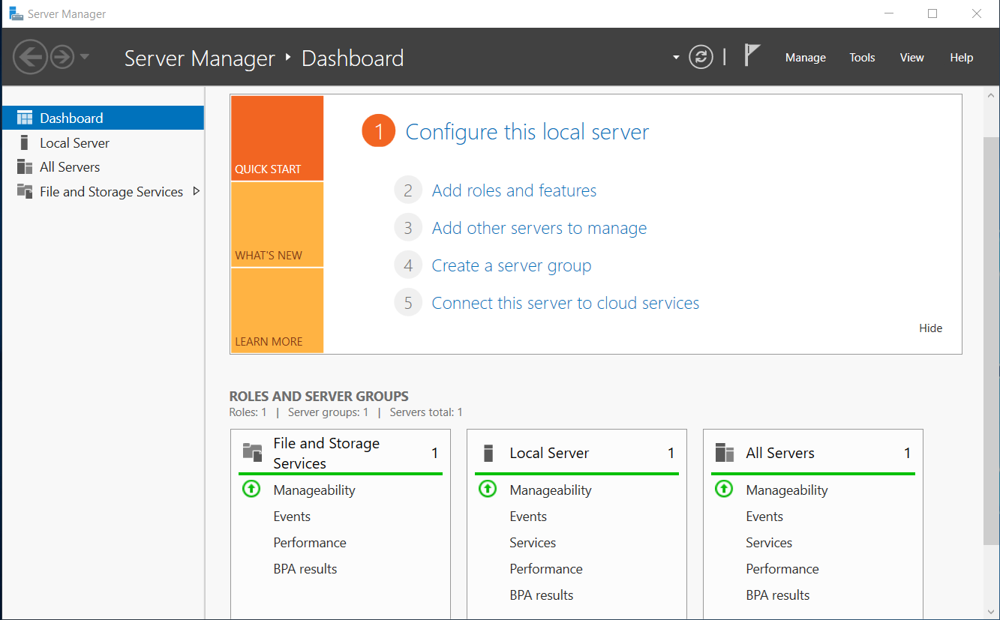

# Environment Setup

## 1. Overview

This environment was created to serve as the foundation for all upcoming Windows Server configuration and hardening work. It runs locally on VMware Workstation using both a host-only and a NAT network to simulate a small enterprise setup. I've aimed to follow the most solid practices for server network architecture and their security.

The host-only network operates on 192.168.45.0/24, while the NAT network uses 192.168.200.0/24. The base system, named Windows Server (WS1), is a clean Windows Server 2019 installation that will later be cloned into other machines such as Domain Controller 1 (DC1) and Client/Member Server (MS1).

This document is organized into the following sections:

- System Requirements: hardware and software prerequisites.

- VMware Network Configuration: details of the virtual network setup.

- Windows Server Installation: installation process and base system notes.

- Snapshot and Backup Strategy: methods to preserve configuration states.

- Systems verification: confirming the environment is ready.

I tried to include in each section a screenshot of the subject to showcase better.

## 2. System Requirements
 

| Component | Minimum | Recommended |
|------------|----------|--------------|
| Host OS | Windows 10/11 | Windows 11 Pro |
| Virtualization | VMware Workstation | VMware Workstation Pro 17+ |
| RAM | 8 GB | 16 GB+ |
| Storage | ~ 60 GB | SSD ~ 100 GB+ |
| Network | VMnet1 (Host-Only), VMnet8 (NAT) | Static IP ranges configured |

## 3. VMware Network Configuration

The virtual environment is designed with two routing layers to ensure strong isolation and controlled access. 

The first router is the main primary LAN router, which provides internet connectivity. The second one is an intermediate NAT router with a built-in firewall, responsible for creating a dedicated private network for all lab virtual machines.

A bastion host is positioned between these two networks, acting as the secure bridge between the household LAN and the isolated lab segment. It provides controlled administrative SSH access without exposing internal systems directly.

Within this private network, VMnet1 operates as Host-Only on 192.168.45.0/24, while VMnet8 runs in NAT mode on 192.168.200.0/24. In order to have a stable balance between isolation and external / temporary connectivity, DHCP is disabled on VMnet1 and enabled on VMnet8 initially.

   
  <b>Image 1 – VMnet1 Configuration</b>

 

   
  <b>Image 2 – VMnet8 Configuration</b>

This layered architecture aims to ensure that the lab remains fully segregated from the physical LAN, while the bastion host and 2nd NAT firewall router enables safe management and selective outbound connectivity, when required.

## 4. Windows Server Installation

The base virtual machine WS1 was deployed using the Windows Server 2019 ISO obtained from the [Azure Dev Tools for Teaching repository](https://azureforeducation.microsoft.com/devtools/). Installation followed the standard graphical setup, selecting the Desktop Experience edition to include a full GUI. Default disk partitioning was applied, and the assigned product key was entered during setup.

After installation, the network adapter was temporarily switched to VMnet8 (NAT) mode, allowing outbound traffic through the host system’s firewall rather than exposing the VM directly to the physical LAN. During this phase, Windows Firewall was checked to be enabled, and administrative shares or RDP access to the LAN were disabled to minimize exposure.

   
  <b>Image 3 – WS1</b>

Once updates were complete, the adapter was reverted to the host-only network to restore full isolation.

   
  <b>Image 4 – Server Manager dashboard</b>

This WS1 virtual machine will act as the baseline image for subsequent systems - DC1, MS1 and additional ones - that will be cloned and reconfigured as part of later configuration stages.

## 5. Snapshot and Backup Strategy
After completing the installation and configuration of WS1, a snapshot was created to preserve this clean baseline state. This snapshot, labeled “After Installation”, allows quick recovery if later configuration or testing introduces issues.

Snapshots are stored locally on the same drive as the virtual machine, and ideally these also should be exported or backed up periodically to an external SSD or to the cloud. This would ensure recovery even in case of hardware failure.

When major configuration milestones are reached (e.g., domain creation, security hardening), a new snapshot is taken and named accordingly for traceability.

I kept at least two generations of snapshots: one stable baseline and one most recent configuration checkpoint.

## 6. Systems verification

When switching from VMnet8 to 1, I realized that I still hadn't assigned a static IP address, therefore the VM got an APIPA one:

   
  <b>Image 5 – APIPA address</b>

Quicky after the change:

   
  <b>Image 6 – TCP/IPv4 properties</b>

   
  <b>Image 4 – IPv4 address</b>

## 8. Notes & References
Additional remarks, version notes, and official documentation links.
