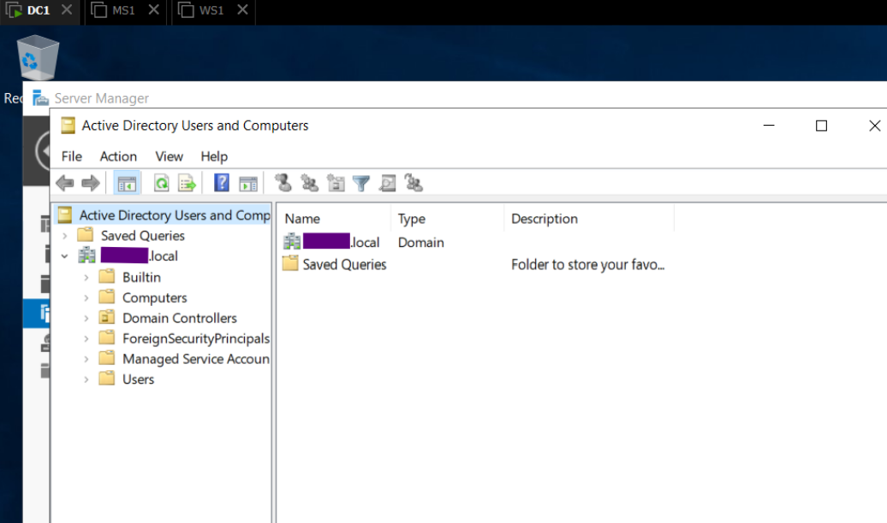

# Domain Controller Configuration
## 1. Overview

This section documents the setup and configuration of Windows Server 2019 for domain administration.

The process includes creating and configuring a domain controller (DC1), joining a Windows 10 client (MS1) to the domain, and performing a compliance baseline using Microsoft’s Security Compliance Toolkit.

All configurations were completed in a secure, isolated VMware environment, following best practices for system hardening that was mentioned in the previous section 0_Environment-Setup.

## 2. Domain Controller preparation 

To begin the DC1 server configuration, the base image WS1 was duplicated to create a new virtual machine named DC1. The cloning process was performed in VMware Workstation using a full clone, ensuring that the resulting instance was completely independent from the source.

Once the operation completed, the virtual hardware and folder paths were verified to confirm that DC1 could operate autonomously within the isolated lab network.

   <b>Image 1 – VMware Inventory View</b> 

After powering on the new system, the local Administrator account was used to sign in and modify the computer name from WS1 to DC1 through System Properties. A restart followed to apply the change, allowing the system to broadcast its new identity across the internal network.

   <b>Image 2 – System Properties </b> 

The next step consisted of assigning static network parameters to guarantee consistent connectivity within the 192.168.45.0/24 segment. The IP address 192.168.45.10 was selected for DC1 with a subnet mask of 255.255.255.0. Because this server would later host DNS services, the preferred DNS was temporarily set to the loopback address 127.0.0.1.

Finally, the system state was validated in Server Manager. The Local Server summary displayed the correct hostname, IP configuration, and default security posture with Windows Firewall and Defender enabled.

At this point, DC1 was fully prepared for the installation of Active Directory Domain Services and promotion to a domain controller in the following phase.

   <b>Image 3 – Server Roles Configuration</b> 
 

   <b>Image 4 – Active Directory Users and Computers</b> 
 

   <b>Image 5 – AD DS Management View</b> 

## 3. DC1 promotion as Domain Controller
 

After completing the initial setup of DC1, the system was promoted to a domain controller using the Server Manager interface. The Active Directory Domain Services role was installed to enable centralized authentication and directory management within the internal network. Upon completion, the configuration wizard was executed to promote the server to a domain controller.

A new forest was created using the fully qualified domain name, which established the root domain for subsequent systems. The NetBIOS name adopted the prefix “S” followed by the domain name to ensure uniform naming conventions. Default parameters were maintained throughout the configuration process, and a secure Directory Services Restore Mode (DSRM) password was defined in accordance with complexity standards. After the prerequisite checks passed successfully, the system rebooted automatically to finalize the promotion.

Once restarted, DC1 became the central authority for authentication and DNS resolution within the 192.168.45.0/24 network segment, marking the completion of the domain controller setup.

   <b>Image 6 – Domain Controller Summary</b> 

## 4. Client/Member Server configuration 

Following the successful configuration of DC1, the Windows 10 workstation was prepared to function as a domain member. The virtual machine was renamed MS1 and configured with an IP address corresponding to the network topology. The preferred DNS setting was updated to reference DC1’s address, ensuring proper name resolution and communication with the domain services.

Once the network connectivity was confirmed, MS1 was joined to the domain via the System Properties interface. Authentication was carried out using the domain administrator credentials, validating the connection and enabling domain-based login. The workstation was successfully integrated into the domain, gaining access to centralized authentication, Group Policy management, and future administrative oversight through Active Directory.

   <b>Image 7 – MS1 Client Domain Info</b> 

## 5. Systems verification

Once both systems were configured, network connectivity and authentication functionality were verified. Basic connectivity tests confirmed that DC1 responded to ICMP requests from MS1 and vice versa , validating the static IP configuration and DNS resolution path. The successful login using a domain account demonstrated that authentication requests were properly routed through the domain controller.

   <b>Image 8 – Connectivity test from MS1 Client</b> 

   <b>Image 9 – Connectivity test from DC1 Controller</b> 

At this stage, both the administrative server and the client workstation were operating within the same logical network, with DC1 handling directory services and MS1 functioning as an authenticated member system. This verification step ensured that all core services, including DNS, were properly synchronized and operational.

## 6. Compliance and Baseline Analysis

After confirming system functionality, the Microsoft Security Compliance Toolkit—specifically the Policy Analyzer utility—was employed to perform a detailed baseline configuration analysis. This toolkit enabled a comprehensive evaluation of both DC1 and MS1 against Microsoft’s recommended security standards.

A temporary NAT-enabled network adapter was added to the virtual machines to facilitate system updates and baseline downloads. Windows Defender was then activated and updated, followed by a full system update to align both systems with the most recent security definitions. 

   <b>Image 10 – Command prompt in PolicyAnalyzer directory</b> 

Using Policy Analyzer, the imported baseline configurations were compared against Microsoft’s reference baselines for Windows Server 2016 and Windows 10. The resulting analysis provided clear visibility into configuration discrepancies, highlighting key differences between the current system settings and Microsoft’s secure baseline recommendations.

   <b>Image 11 – Policy Viewer / Analyzer for MS1</b> 

   <b>Image 12 – Policy Viewer / Analyzer for DC1</b> 

Upon completing the analysis, new system snapshots were taken to preserve the stable and verified configuration state. This step ensured that future modifications could be safely reverted if necessary. 

Back to [1_Windows-Server-Administration](README.md)