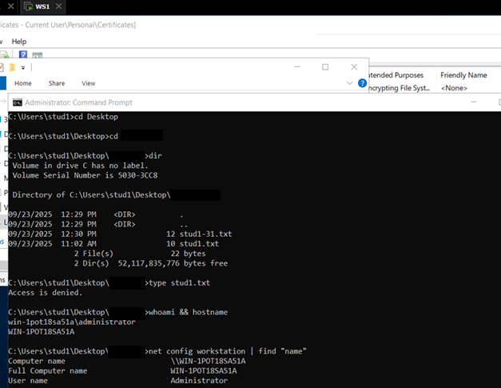

# Encrypting File System and Recovery Agent

## 1. Local EFS Implementation

The purpose of this initial phase was to demonstrate how Windows Server 2019 encrypts data at the file-system level using the Encrypting File System (EFS). 

This lab section began under the local Administrator account, where a desktop folder named _SecretData_ was created and configured with the option Encrypt contents to secure data. From that point onward, every file placed inside the folder became automatically encrypted through the Administrator’s EFS certificate. A sample text document titled admin.txt was then saved in this directory to validate encryption behavior.

Next, a secondary local user account named stud1 was created and signed in to attempt accessing the encrypted file. When stud1 navigated to the Administrator’s desktop and opened the _SecretData_ directory, the folder name appeared in green, confirming that encryption was active. Attempting to open _admin.txt_ resulted in an “Access Denied” message, showing that EFS restricts decryption strictly to the certificate owner.

   <b>Image 1 – Stud1 denied access to Administrator’s encrypted file</b> 

To reinforce the concept of user-specific encryption, stud1 then created a personal folder on the desktop and repeated the process, generating an encrypted file called stud1.txt. After signing out, the Administrator attempted to open this file but was unable to decrypt its contents, confirming that each user’s EFS certificate is unique and cannot decrypt another user’s data.

   <b>Image 2 – Administrator denied access to Stud1’s encrypted file</b> 

## 2. Command-Line Encryption with Cipher

This part focused on using the Cipher tool to manage encryption from the command line instead of through the graphical interface. 

While logged in as Administrator, a new folder named _mywork_ was created on the desktop. Running `cipher mywork\*` showed the encryption status of the files inside. Items marked with E were encrypted, while those labeled U were still unencrypted. The same command was used on the _SecretData_ folder, confirming that _admin.txt_ had the E attribute.

Next, a folder named _private_ was created with a subfolder personal and a file called _mydata.txt._ The command
`cipher /e /s:private`
was entered to encrypt both the folder and its contents. The `/e` option starts encryption, and `/s` includes all subfolders. After that, the personal folder turned green in File Explorer, showing encryption was active. Any new file saved inside was automatically protected.

   <b>Image 3 – Encrypting the “private” directory using Cipher command</b> 

## 3. Configuring the Recovery Agent

The next part of the lab introduced the Recovery Agent, a backup entity that can decrypt files if the original user’s encryption key becomes unavailable. While logged in as Administrator, a new recovery key pair was created using the command `cipher /r:recover`

   <b>Image 2 –  Creating recovery files </b> 

   <b>Image 2 – Verifying it from the GUI</b> 

The system generated two files — _recover.cer_ (the certificate itself) and _recover.pfx_ (the private key) — both saved on the desktop. These files were password-protected to prevent unauthorized use.

To register the Recovery Agent, the Microsoft Management Console (MMC) was opened by running `mmc` from the Run dialog. Inside MMC, the Certificates snap-in was added for the current user. In the Personal > Certificates folder, the _recover.pfx_ file was imported using the Certificate Import Wizard. During the process, the option Mark this key as exportable was selected to allow future backups.

Once imported, the Local Security Policy tool was opened from Administrative Tools, and under Public Key Policies > Encrypting File System, the newly added certificate was designated as the Recovery Agent. The system confirmed this setup by showing the new entry in the list of recovery agents.

   <b>Image 2 – Importing the RA certificate into MMC, showing Administrator’s EFS certificate</b> 

Although the `cipher /r:recover` command creates the Recovery Agent certificate, it uses the old **SHA-1** hash algorithm by default.  

For stronger cryptographic security, the certificate can also be generated using **SHA-256** , for example, through PowerShell as shown below:

   <b>Image 2 – Certificate generated using SHA256 hash algorithm</b> 

## 4. Verifying Recovery Access

After configuring the Recovery Agent, the next step was to confirm how recovery access works for files encrypted before and after the Recovery Agent designation.

While logged in as Administrator, an attempt was made to open the file _stud1.txt_ that had been created earlier by the stud1 account. Access was denied. This confirmed that files encrypted before the Recovery Agent was assigned could not be decrypted retroactively, since the recovery attribute had not yet been embedded in the file metadata.

   <b>Image 2 – Administrator denied access to stud1.txt created before RA assignmen</b> 

Next, the stud1 user signed in again and created a second encrypted file, _stud1-31.txt_, within the same folder. After logging back in as Administrator, this new file was opened successfully. This proved that once the Recovery Agent was in place, all new encrypted files automatically included the RA certificate, allowing administrative recovery.

   <b>Image 2 – Administrator successfully accessing the new .txt after RA setup</b> 

This demonstrated the user-specific and time-sensitive nature of EFS: encryption keys and recovery permissions apply only to files created after the relevant security configuration exists.

To confirm this behavior visually, the file’s properties were checked through Advanced Attributes > Details. The Recovery Agent field listed the Administrator certificate, verifying that the new file was encrypted with both the user’s key and the RA’s key.

   <b>Image 2 – File encryption details showing Administrator as Recovery AgentI</b> 

# 5. Exporting and Deleting Certificates

The final stage of the lab focused on safeguarding and testing the Recovery Agent’s certificate. As Administrator, the Certificate Export Wizard was launched from within the MMC console. The Recovery Agent’s private key and certificate were exported in Personal Information Exchange (.pfx) format and saved on the desktop as _export_recovery.pfx._ During export, the option to include all certificates in the certification path and protect the file with a password was selected:

   <b>Image 2 – Exporting the Recovery Agent certificate to a .pfx file</b> 

After confirming that the exported file was successfully created, the original recovery certificate was deleted from the Personal > Certificates store. Once the certificate was removed, Administrator attempted again to open the file _stud1-31.txt._ This time, access was denied — demonstrating that without the recovery certificate (RC), the Administrator could no longer decrypt files encrypted under the EFS system.

   <b>Image 2 – Administrator denied access to encrypted file after deleting RC</b> 

This part of the lab proved that the exported key file is essential for restoring recovery capabilities. Losing or deleting the certificate from the system effectively disables administrative recovery for existing encrypted files.

# 6. Conclusion

This lab demonstrated how Encrypting File System works on Windows Server 2019 and how a Recovery Agent can be configured to ensure secure data recovery. The exercises showed that encryption is strictly user-based — each user’s EFS certificate allows access only to files they have encrypted.

Through the creation of a Recovery Agent, it was confirmed that newly encrypted files automatically inherit the recovery policy, while files encrypted before the agent was designated remain inaccessible. The export and deletion tests highlighted the importance of safeguarding the Recovery Agent’s private key, as its loss permanently removes the ability to recover encrypted data.

Overall, this activity reinforced key concepts of file-level encryption, certificate management, and essential administrative recovery procedures in Windows Server.