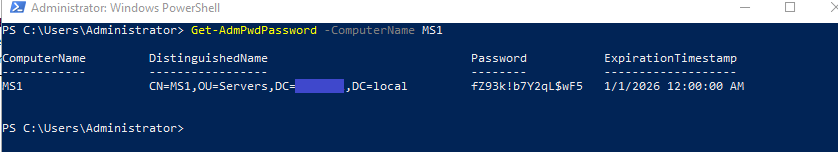
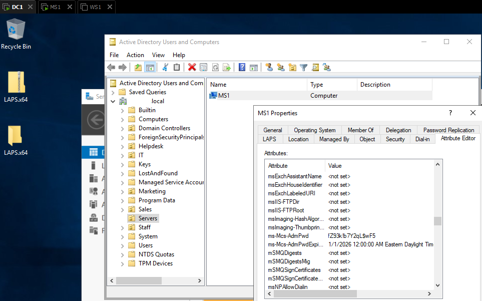

# Local Administrator Password Solution (LAPS)

## 1. Configuring User Rights Assignment

This part began by accessing the Default Domain Controllers Policy through the Group Policy Management Console on DC1. The focus was to verify and adjust several user rights to ensure the correct administrative groups had the necessary privileges.

The Backup, Restore, and Shutdown permissions were reviewed and configured to include the Administrators, Backup Operators, and Server Operators groups. In addition, the Key Admins group was added where required to align with the security design of the domain.

Each policy was opened individually from the User Rights Assignment list, modified if necessary, and then applied. 

   <b>Image 1 – Configuring User Rights Assignment in GPO</b> 

# 2. Creating and Linking GPOs

This part focused on building a structure to manage server-specific security policies. A new Organizational Unit named Servers was created in Active Directory to keep all managed machines under one container. After that, a new Group Policy Object called Remote Credential Guard was linked to it.

Inside the Group Policy Management Editor, the setting Restrict delegation of credentials to remote servers was enabled under the Credentials Delegation section. Because some versions of Windows Server do not show the _Prefer Remote Credential Guard_ option, the _Require Remote Credential Guard_ value was applied instead to achieve the same protection level, ensuring the policy strictly enforces credential protection and prevents fallback to less secure methods.

Once configured, the GPO was closed and saved, ensuring that any computer account later moved into the Servers OU would automatically inherit these protections.

   <b>Image 2 – Enabling Remote Credential Guard Policy</b> 

# 3. Installing and Configuring LAPS

SInce LAPS was installed to improve password management security across domain machines, the installer was first executed on the domain controller (DC1) to add the Group Policy Management extensions. After installation, the LAPS administrative templates became available within the Group Policy Management Editor.

Next, LAPS was deployed on the member server (MS1) to enable local password management on that system. The installation was limited to the required GPO extension so that the managed machine could communicate its password securely to Active Directory.

Following installation, a new GPO was created to enable LAPS management and configure automatic password changes for local administrators. Once applied, the `ms-Mcs-AdmPwd` attribute became visible under the Attribute Editor tab of the MS1 computer object in Active Directory Users and Computers, confirming that LAPS was correctly updating and storing passwords.

This configuration ensures that each domain computer maintains a unique, automatically rotated local administrator password, enhancing the overall security posture of the environment.

   <b>Image 3 – MS1 Attribute Editor / Properties</b> 

# 4. Verifying LAPS Implementation

After deploying the LAPS Group Policy, the configuration was verified from DC1 using Active Directory Users and Computers. On the MS1 computer object, the Attribute Editor tab showed that the ms-Mcs-AdmPwd attribute had been automatically populated with a random, complex password. 

   <b>Image 4 – MS1  powershell </b> 

This value appeared after forcing a Group Policy update on MS1 with `gpupdate /force`. The same password could also be retrieved from PowerShell on DC1 using `Get-AdmPwdPassword -ComputerName MS1`, confirming that the LAPS policy was successfully applied and the local administrator credentials were being securely rotated and stored in Active Directory.

   <b>Image 4 – MS1 Attribute Editor / Properties</b> 

