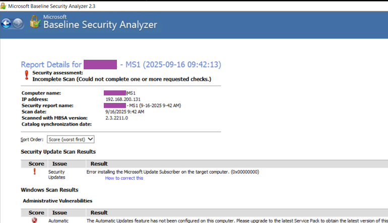
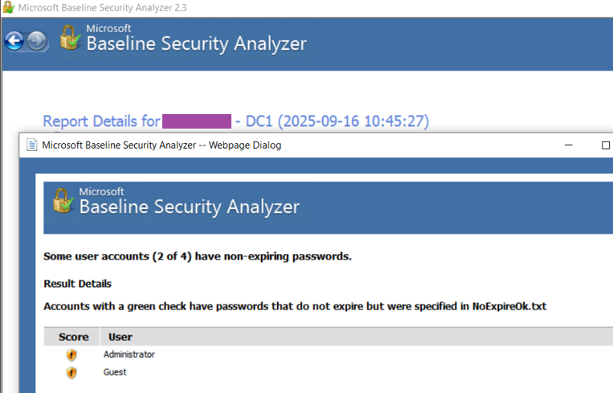
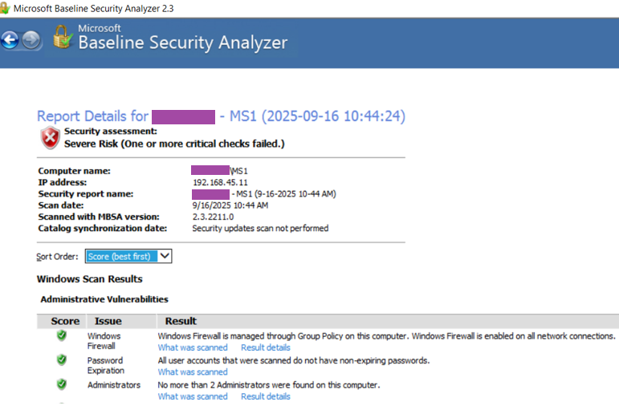
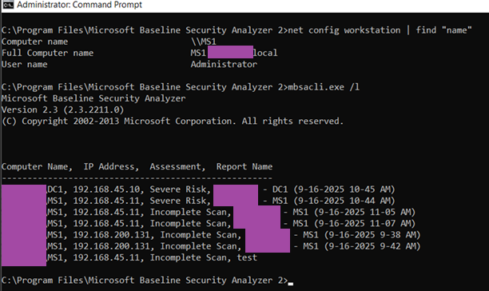

# MBSA and Security Baseline
## 1. Overview

The Windows 10 virtual machine was powered on and confirmed to be connected to both Host-Only and NAT networks. Logged in as Domain Administrator, Microsoft Baseline Security Analyzer 2.3 was installed and executed with default settings. The local system name appeared automatically in the Computer Name field, confirming successful detection. Before initiating the scan, the option to configure computers for Microsoft Update and scanning prerequisites was selected to ensure that the latest definitions were retrieved. The scan completed successfully and produced the first client report for MS1.

   <b>Image 1 – Report Details for MS1 within the lab NAT segment</b> 

## 2. WS1 Admin / Password Report

An additional MBSA scan was performed from the same workstation, targeting both the local system and the domain controller. This report focused on password-expiration status, firewall configuration, and automatic update verification. The results confirmed that administrative accounts were valid, the Guest account remained disabled, and no unnecessary services were detected. These outcomes verified that baseline security configurations across both systems were aligned with standard requirements.

   <b>Image 2 – Password report details for DC1</b> 

   <b>Image 3 – Report Details for MS1</b> 

## 3. MBSA CLI Output of MS1

To confirm command-line operation, MBSA was executed using the mbsacli.exe tool from the Windows 10 virtual machine. The scan was restricted to operating-system and password-related checks, and the results were stored as an XML file within the MBSA directory. Running the “mbsacli /l” command confirmed that the file had been successfully generated and listed among the completed reports. The CLI and GUI scans produced matching outcomes, demonstrating consistent analysis between both interfaces.

   <b>Image 3 – VMware Inventory View</b> 

The scan reported a “Severe Risk” assessment, caused by the inability to verify update compliance due to limited external connectivity within the lab environment. This result was expected since the virtual network was isolated and access to Microsoft Update servers was restricted during the test.

