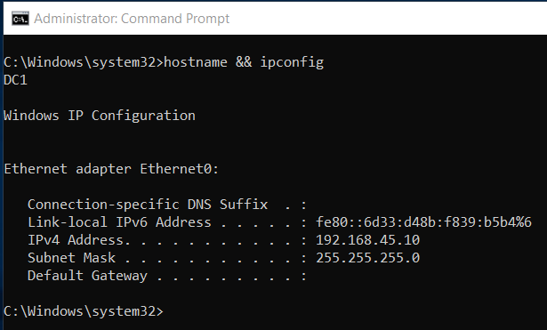
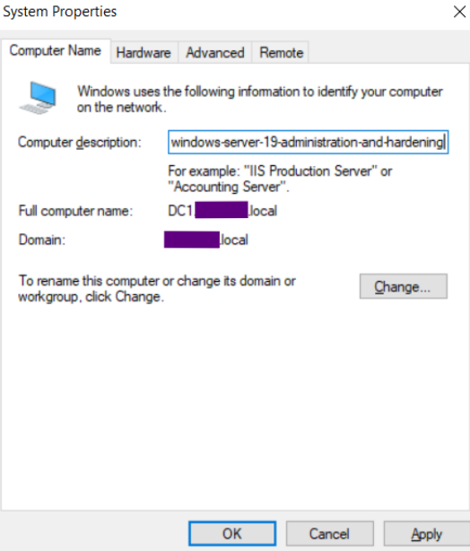
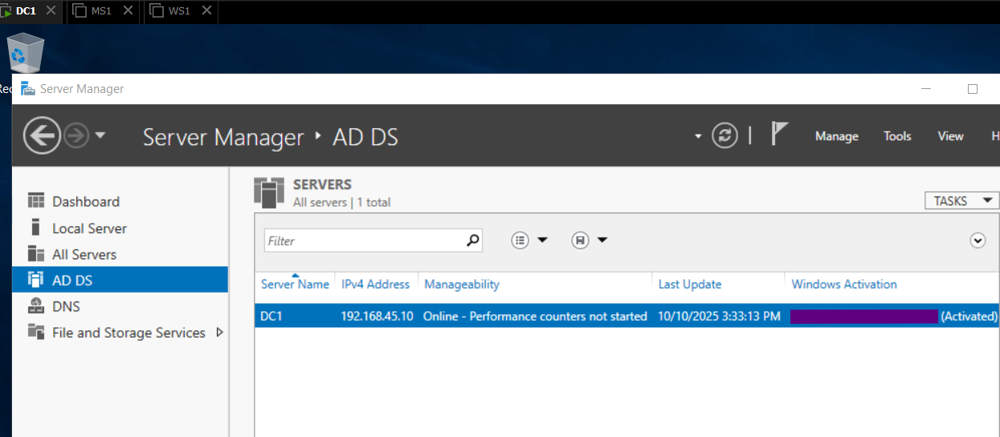
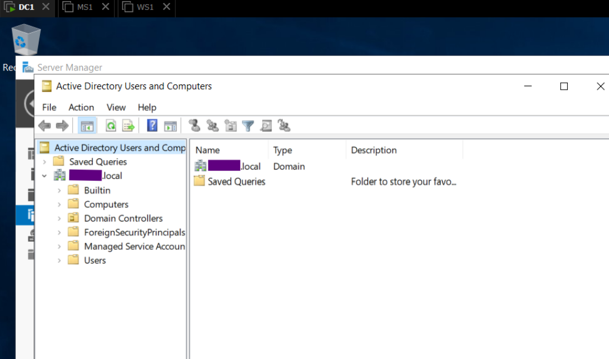

# Environment Setup

## 1. Overview
This section documents the setup and configuration of Windows Server 2019 for domain administration.
The process includes creating and configuring a domain controller (DC1), joining a Windows 10 client (MS1) to the domain, and performing a 101 compliance baseline using Microsoft’s Security Compliance Toolkit.

All configurations were completed in a secure, isolated VMware environment, following best practices for system hardening and data protection that were mentioned in the previous section 0_Environment-Setup.

## 2. Domain Controller configuration 

To begin the server configuration, the base image WS1 was duplicated to create a new virtual machine named DC1. The cloning process was performed in VMware Workstation using a full clone, ensuring that the resulting instance was completely independent from the source. Once the operation completed, the virtual hardware and folder paths were verified to confirm that DC1 could operate autonomously within the isolated lab network.

   
  <b>Image 1 – VMware Inventory View with DC devices</b>

After powering on the new system, the local Administrator account was used to sign in and modify the computer name from WS1 to DC1 through System Properties. A restart followed to apply the change, allowing the system to broadcast its new identity across the internal network.

The next step consisted of assigning static network parameters to guarantee consistent connectivity within the 192.168.45.0/24 segment. The IP address 192.168.45.10 was selected for DC1 with a subnet mask of 255.255.255.0. Because this server would later host DNS services, the preferred DNS was temporarily set to the loopback address 127.0.0.1. 

   
  <b>Image 2 – Hostname and Windows IP configuration</b>

## 3. DC1 promotion as Domain Controller

With DC1 fully prepared and network settings verified, the next step was to install and configure Active Directory Domain Services (AD DS) so the server could function as a domain controller. 

The installation began from Server Manager, using the Add Roles and Features wizard. After launching the wizard, the role Active Directory Domain Services was selected, while all default features were left enabled. Once installation completed successfully, a notification appeared in Server Manager prompting for post-deployment configuration.

   
  <b>Image 3 – Server Roles selection</b>

The configuration wizard was then used to promote the server. Since this was the first domain in the lab environment, a new forest was created using the namespace _PII.local_. In the NetBIOS name field, the prefix “S” was added before the student number. The remaining settings were left at their defaults, including database, log, and SYSVOL locations.

   
  <b>Image 4 – System Properties</b>

During the promotion process, a Directory Services Restore Mode (DSRM) password was specified that met complexity requirements: uppercase, lowercase, numeric characters, and at least six characters in total. Once confirmed, the wizard validated prerequisites and prompted for a restart to complete the operation.

After reboot, DC1 automatically booted into domain mode, and the login screen reflected the new domain context, confirming successful promotion. Signing in with the domain Administrator account opened Server Manager, where the AD DS dashboard now showed the server listed as a domain controller.

   
  <b>Image 5 – AD DS Manager dashboard</b>

Finally, a brief inspection of Active Directory Users and Computers confirmed the domain structure. The forest name hierarchy was visible with default containers such as Users, Computers, and Domain Controllers. This verification step ensured that replication and policy services were initialized correctly and that DC1 was ready to host domain operations for subsequent configuration tasks.

   
  <b>Image 6 – Active Directory Users and Computers  </b>

## 4. Client/Member Server configuration 

The base virtual machine WS1 was deployed using the Windows Server 2019 ISO obtained from the [Azure Dev Tools for Teaching repository](https://azureforeducation.microsoft.com/devtools/). Installation followed the standard graphical setup, selecting the Desktop Experience edition to include a full GUI. Default disk partitioning was applied, and the assigned product key was entered during setup.

   
  <b>Image 3 – WS1</b>

After installation, the network adapter was temporarily switched to VMnet8 (NAT) mode, allowing outbound traffic through the host system’s firewall rather than exposing the VM directly to the physical LAN. During this phase, Windows Firewall was checked to be enabled, and administrative shares or RDP access to the LAN were disabled to minimize exposure. 

Once updates were complete, the adapter was reverted to the host-only network to restore full isolation.

   
  <b>Image 4 – Server Manager dashboard</b>

This WS1 virtual machine will act as the baseline image for subsequent systems - DC1, MS1 and additional ones - that will be cloned and reconfigured as part of later configuration stages.

## 5. Compliance and Baseline Analysis

After completing the installation and configuration of WS1, a snapshot was created to preserve this clean baseline state. This snapshot, labeled “After Installation”, allows quick recovery if later configuration or testing introduces issues.

Snapshots are stored locally on the same drive as the virtual machine, and ideally these also should be exported or backed up periodically to an external SSD or to the cloud. This would ensure recovery even in case of hardware failure.

When major configuration milestones are reached (e.g., domain creation, security hardening), a new snapshot is taken and named accordingly for traceability.

I kept at least two generations of snapshots: one stable baseline and one most recent configuration checkpoint.

## 6. Systems verification

When switching from VMnet8 to 1, I realized that I still hadn't assigned a static IP address, therefore the VM got an APIPA one:

   
  <b>Image 5 – APIPA address</b>

Quicky after the change:

   
  <b>Image 6 – TCP/IPv4 properties</b>

   
  <b>Image 7 – IPv4 address</b>

## 8. Notes & References
Additional remarks, version notes, and official documentation links.
