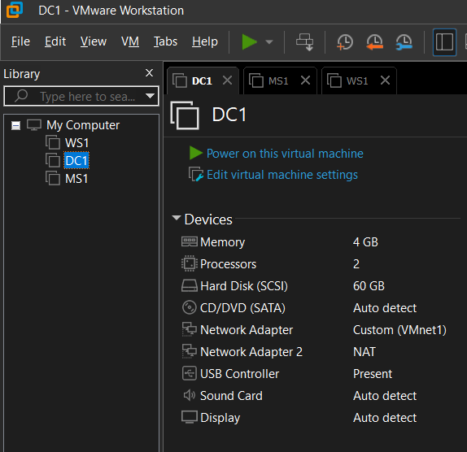

# Environment Setup

## 1. Overview

This section documents the setup and configuration of Windows Server 2019 for domain administration.

The process includes creating and configuring a domain controller (DC1), joining a Windows 10 client (MS1) to the domain, and performing a compliance baseline using Microsoft’s Security Compliance Toolkit.

All configurations were completed in a secure, isolated VMware environment, following best practices for system hardening that was mentioned in the previous section 0_Environment-Setup.

## 2. Domain Controller preparation 

To begin the DC1 server configuration, the base image WS1 was duplicated to create a new virtual machine named DC1. The cloning process was performed in VMware Workstation using a full clone, ensuring that the resulting instance was completely independent from the source.

Once the operation completed, the virtual hardware and folder paths were verified to confirm that DC1 could operate autonomously within the isolated lab network.

   <b>Image 1 – VMware Inventory View</b> 

After powering on the new system, the local Administrator account was used to sign in and modify the computer name from WS1 to DC1 through System Properties. A restart followed to apply the change, allowing the system to broadcast its new identity across the internal network.

   <b>Image 2 – System Properties </b> 

The next step consisted of assigning static network parameters to guarantee consistent connectivity within the 192.168.45.0/24 segment. The IP address 192.168.45.10 was selected for DC1 with a subnet mask of 255.255.255.0. Because this server would later host DNS services, the preferred DNS was temporarily set to the loopback address 127.0.0.1.

Finally, the system state was validated in Server Manager. The Local Server summary displayed the correct hostname, IP configuration, and default security posture with Windows Firewall and Defender enabled.

At this point, DC1 was fully prepared for the installation of Active Directory Domain Services and promotion to a domain controller in the following phase.

   <b>Image 3 – Server Roles Configuration</b> 
 

   <b>Image 4 – Active Directory Users and Computers</b> 
 

   <b>Image 5 – AD DS Management View</b> 

## 3. DC1 promotion as Domain Controller

The virtual environment is designed with two routing layers to ensure strong isolation and controlled access. 

The first router is the main primary LAN router, which provides internet connectivity. The second one is an intermediate NAT router with a built-in firewall, responsible for creating a dedicated private network for all lab virtual machines.

A bastion host is positioned between these two networks, acting as the secure bridge between the household LAN and the isolated lab segment. It provides controlled administrative SSH access without exposing internal systems directly.

Within this private network, VMnet1 operates as Host-Only on 192.168.45.0/24, while VMnet8 runs in NAT mode on 192.168.200.0/24. In order to have a stable balance between isolation and external / temporary connectivity, DHCP is disabled on VMnet1 and enabled on VMnet8 initially.

   
  <b>Image 1 – VMnet1 Configuration</b>

 

   
  <b>Image 2 – VMnet8 Configuration</b>

This layered architecture aims to ensure that the lab remains fully segregated from the physical LAN, while the bastion host and 2nd NAT firewall router enables safe management and selective outbound connectivity, when required.

## 4. Client/Member Server configuration 

Following the successful configuration of DC1, the Windows 10 workstation was prepared to function as a domain member. The virtual machine was renamed MS1 and configured with an IP address corresponding to the network topology. The preferred DNS setting was updated to reference DC1’s address, ensuring proper name resolution and communication with the domain services.

Once the network connectivity was confirmed, MS1 was joined to the domain via the System Properties interface. Authentication was carried out using the domain administrator credentials, validating the connection and enabling domain-based login. The workstation was successfully integrated into the domain, gaining access to centralized authentication, Group Policy management, and future administrative oversight through Active Directory.

## 5. Systems verification

Once both systems were configured, network connectivity and authentication functionality were verified. Basic connectivity tests confirmed that DC1 responded to ICMP requests from MS1, validating the static IP configuration and DNS resolution path. The successful login using a domain account demonstrated that authentication requests were properly routed through the domain controller.

At this stage, both the administrative server and the client workstation were operating within the same logical network, with DC1 handling directory services and MS1 functioning as an authenticated member system. This verification step ensured that all core services, including DNS, were properly synchronized and operational.

## 6. Compliance and Baseline Analysis

After confirming system functionality, the Microsoft Security Compliance Toolkit was employed to perform a baseline configuration analysis. This toolkit allowed a comprehensive evaluation of both DC1 and MS1 in comparison with Microsoft’s recommended security standards.

A temporary NAT-enabled network adapter was added to the virtual machines to facilitate system updates and baseline downloads. Windows Defender was activated and updated, followed by a full system update to align both systems with current security definitions. Using the toolkit, baseline configurations were imported and compared against the Microsoft reference baselines for Windows Server 2016 and Windows 10. The comparative analysis provided insights into configuration gaps, highlighting key differences between the default setup and Microsoft’s secure baseline recommendations.

   <b>Screenshot 4 – Security Compliance Toolkit Command Syntax</b> 

Upon completing the analysis, new system snapshots were taken to preserve the stable and verified configuration state. This step ensured that future modifications could be safely reverted if necessary. 