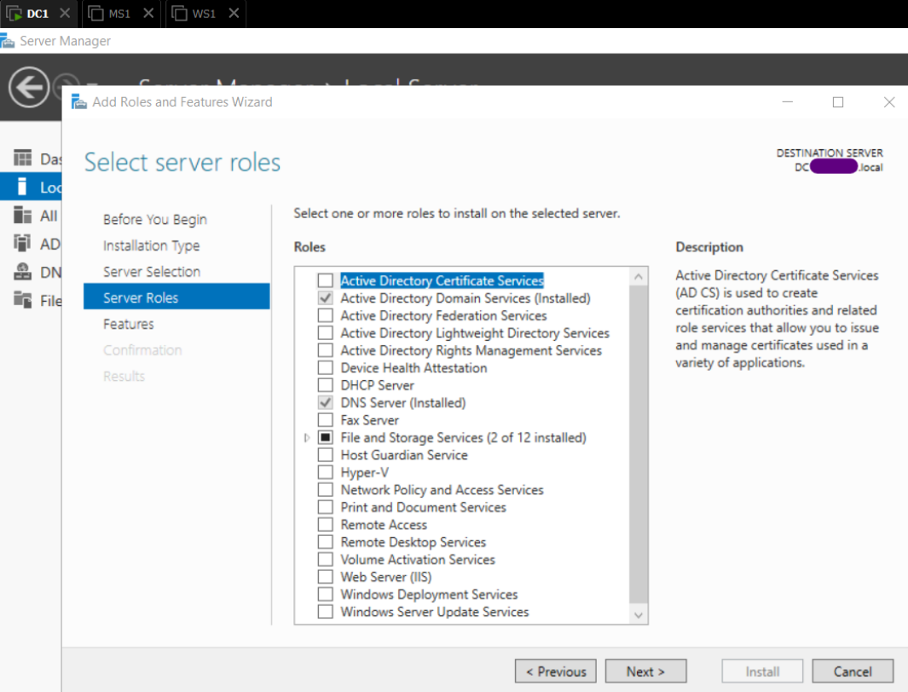

# Environment Setup

## 1. Overview

This section documents the setup and configuration of Windows Server 2019 for domain administration.

The process includes creating and configuring a domain controller (DC1), joining a Windows 10 client (MS1) to the domain, and performing a compliance baseline using Microsoft’s Security Compliance Toolkit.

All configurations were completed in a secure, isolated VMware environment, following best practices for system hardening that was mentioned in the previous section 0_Environment-Setup.

## 2. Domain Controller preparation 

To begin the DC1 server configuration, the base image WS1 was duplicated to create a new virtual machine named DC1. The cloning process was performed in VMware Workstation using a full clone, ensuring that the resulting instance was completely independent from the source.

Once the operation completed, the virtual hardware and folder paths were verified to confirm that DC1 could operate autonomously within the isolated lab network.

   <b>Image 1 – VMware Inventory View</b> 

After powering on the new system, the local Administrator account was used to sign in and modify the computer name from WS1 to DC1 through System Properties. A restart followed to apply the change, allowing the system to broadcast its new identity across the internal network.

   <b>Image 2 – System Properties </b> 

The next step consisted of assigning static network parameters to guarantee consistent connectivity within the 192.168.45.0/24 segment. The IP address 192.168.45.10 was selected for DC1 with a subnet mask of 255.255.255.0. Because this server would later host DNS services, the preferred DNS was temporarily set to the loopback address 127.0.0.1.

Finally, the system state was validated in Server Manager. The Local Server summary displayed the correct hostname, IP configuration, and default security posture with Windows Firewall and Defender enabled.

At this point, DC1 was fully prepared for the installation of Active Directory Domain Services and promotion to a domain controller in the following phase.

   <b>Image 3 – Server Roles Configuration</b> 
 

   <b>Image 4 – Active Directory Users and Computers</b> 
 

   <b>Image 5 – AD DS Management View</b> 

## 3. DC1 promotion as Domain Controller

The virtual environment is designed with two routing layers to ensure strong isolation and controlled access. 

The first router is the main primary LAN router, which provides internet connectivity. The second one is an intermediate NAT router with a built-in firewall, responsible for creating a dedicated private network for all lab virtual machines.

A bastion host is positioned between these two networks, acting as the secure bridge between the household LAN and the isolated lab segment. It provides controlled administrative SSH access without exposing internal systems directly.

Within this private network, VMnet1 operates as Host-Only on 192.168.45.0/24, while VMnet8 runs in NAT mode on 192.168.200.0/24. In order to have a stable balance between isolation and external / temporary connectivity, DHCP is disabled on VMnet1 and enabled on VMnet8 initially.

   
  <b>Image 1 – VMnet1 Configuration</b>

 

   
  <b>Image 2 – VMnet8 Configuration</b>

This layered architecture aims to ensure that the lab remains fully segregated from the physical LAN, while the bastion host and 2nd NAT firewall router enables safe management and selective outbound connectivity, when required.

## 4. Client/Member Server configuration 

The base virtual machine WS1 was deployed using the Windows Server 2019 ISO obtained from the [Azure Dev Tools for Teaching repository](https://azureforeducation.microsoft.com/devtools/). Installation followed the standard graphical setup, selecting the Desktop Experience edition to include a full GUI. Default disk partitioning was applied, and the assigned product key was entered during setup.

   
  <b>Image 3 – WS1</b>

After installation, the network adapter was temporarily switched to VMnet8 (NAT) mode, allowing outbound traffic through the host system’s firewall rather than exposing the VM directly to the physical LAN. During this phase, Windows Firewall was checked to be enabled, and administrative shares or RDP access to the LAN were disabled to minimize exposure. 

Once updates were complete, the adapter was reverted to the host-only network to restore full isolation.

   
  <b>Image 4 – Server Manager dashboard</b>

This WS1 virtual machine will act as the baseline image for subsequent systems - DC1, MS1 and additional ones - that will be cloned and reconfigured as part of later configuration stages.

## 5. Systems verification

After completing the installation and configuration of WS1, a snapshot was created to preserve this clean baseline state. This snapshot, labeled “After Installation”, allows quick recovery if later configuration or testing introduces issues.

Snapshots are stored locally on the same drive as the virtual machine, and ideally these also should be exported or backed up periodically to an external SSD or to the cloud. This would ensure recovery even in case of hardware failure.

When major configuration milestones are reached (e.g., domain creation, security hardening), a new snapshot is taken and named accordingly for traceability.

I kept at least two generations of snapshots: one stable baseline and one most recent configuration checkpoint.

## 6. Compliance and Baseline Analysis

When switching from VMnet8 to 1, I realized that I still hadn't assigned a static IP address, therefore the VM got an APIPA one:

   
  <b>Image 5 – APIPA address</b>

Quicky after the change:

   
  <b>Image 6 – TCP/IPv4 properties</b>

   
  <b>Image 7 – IPv4 address</b>

## 8. Notes & References
Additional remarks, version notes, and official documentation links.
