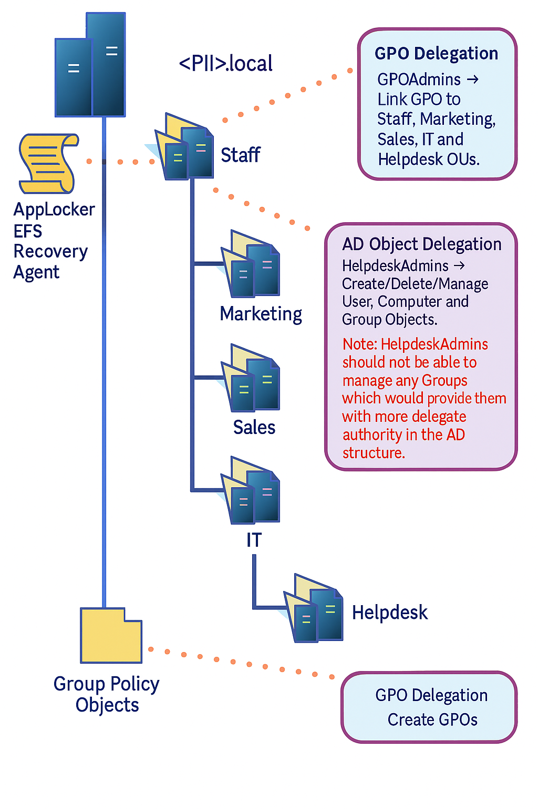
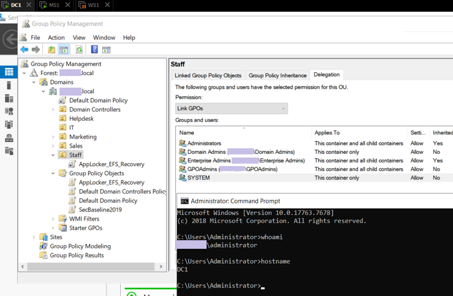
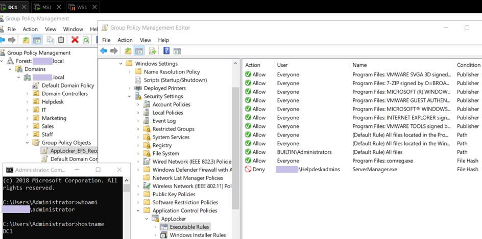
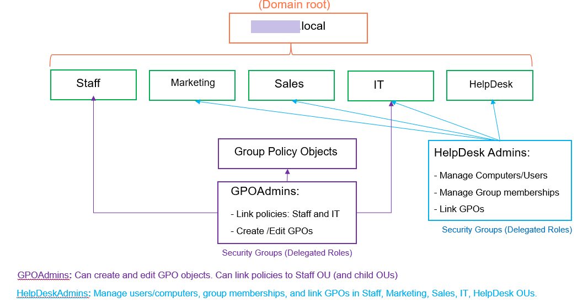

# Windows Domain Controller – Delegation and GPO Management
## 1. Overview

This markdown file presents the configuration and verification of Active Directory delegation and Group Policy Object management in a Windows Server domain. 

The objective was to assign specific administrative responsibilities through security groups, apply AppLocker and EFS Recovery Agent policies, and verify their effects from both the domain controller (DC1) and the member server (MS1).

## 2. Active Directory and Organizational Unit Structure

A logical domain structure was implemented to organize administrative boundaries. The domain included organizational units named Staff, Marketing, Sales, IT, and HelpDesk. 

   <b>Image 1 – AD delegation and GPO relationship overview</b> 

These units defined where group policies and delegated permissions would apply, ensuring that administrative rights were scoped only to relevant containers. The structure aimed to establish a clear hierarchy suitable for role-based access control and subsequent delegation of permissions.

# 3. Security Groups and Delegated Roles

Two main administrative security groups were created to manage Active Directory and Group Policy permissions. 

The first group, HelpDeskAdmins, was responsible for managing users, computers, and group memberships across departmental organizational units. Members of this group were permitted to link existing policies but were restricted from altering the membership of privileged administrative groups.

The second group, GPOAdmins, was authorized to create and edit Group Policy Objects and to link them to organizational units such as Staff and IT. 

This separation of duties maintained strong security boundaries by preventing HelpDesk staff from having unrestricted policy control while still allowing GPOAdmins to perform domain-wide policy tasks.

# 4. GPO Configuration
## EFS Recovery Agent

A dedicated recovery account was created and temporarily added to the Domain Admins group to generate a recovery certificate. 

After the configuration was completed, the account was removed from the group. The EFS policy was linked to the Staff organizational unit and tested on MS1 to verify that files encrypted by one user could be decrypted only by the designated recovery agent. 

The results confirmed that the Recovery user could access encrypted data as intended, ensuring recoverability and security compliance.

   <b>Image 2 – Staff OU Delegation with GPOAdmins permissions</b> 

## AppLocker Rules

An additional Group Policy Object was created and edited under Computer Configuration to define AppLocker rules. Executable, Windows Installer, and script rules were automatically generated, and a specific deny rule was added for members of the HelpDeskAdmins group. This rule used the file hash of ServerManager.exe located in the System32 directory to restrict access to the Server Manager console.

Testing confirmed that when logged in as, for example, Ivan Smith -a member of HelpDeskAdmins - , access to Server Manager was denied, while an administrator could launch it successfully. This behavior validated that the policy was enforced correctly and that administrative privileges were limited according to role.

   <b>Image 3 – AppLocker Executable Rules in GPM Editor</b> 

# 5. Delegation Configuration

Delegation was configured both for Active Directory object management and for Group Policy management.

In Active Directory Users and Computers, the Staff organizational unit was delegated to the HelpDeskAdmins group through the Delegation of Control Wizard. This allowed HelpDeskAdmins to create, delete, and manage users, computers, and groups within the Staff unit, while restrictions were applied to prevent changes to GPOAdmins or HelpDeskAdmins memberships. Verification in the Security tab confirmed that permissions were correctly assigned and limited.

In the Group Policy Management Console, GPOAdmins were added to the delegation tab of the Group Policy Objects container, allowing them to create new GPOs and link them to organizational units. The Staff OU was explicitly configured to grant linking rights to GPOAdmins. This configuration was validated from MS1 to ensure remote management capabilities were operational.

   <b>Image 4 – Active Directory GPO and delegation structure</b> 

# 6. Verification and Testing

Verification was carried out by testing account capabilities under both security groups. 

Members of HelpDeskAdmins could create and manage users and computers within the Staff OU but were denied access to the Domain Controllers OU and restricted from modifying administrative group memberships. GPOAdmins were able to create and link new Group Policy Objects successfully. 

When a HelpDeskAdmins user attempted to open ServerManager.exe, the application was blocked by AppLocker as expected, while administrative users retained full access. These results confirmed that the delegation and GPO configurations functioned as intended.