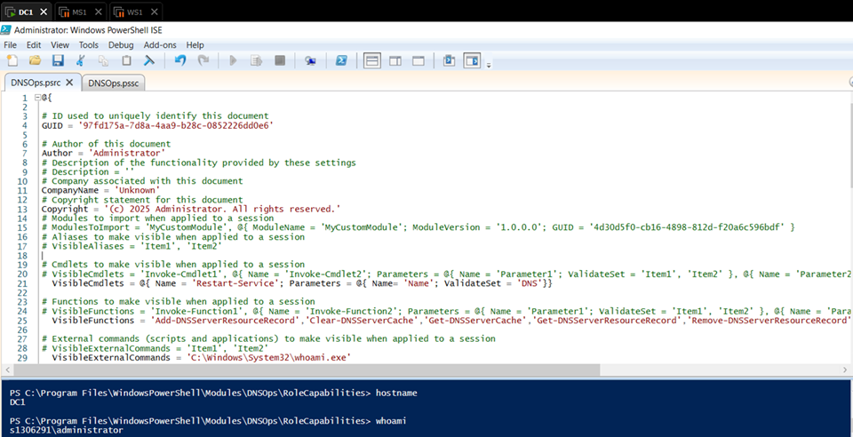
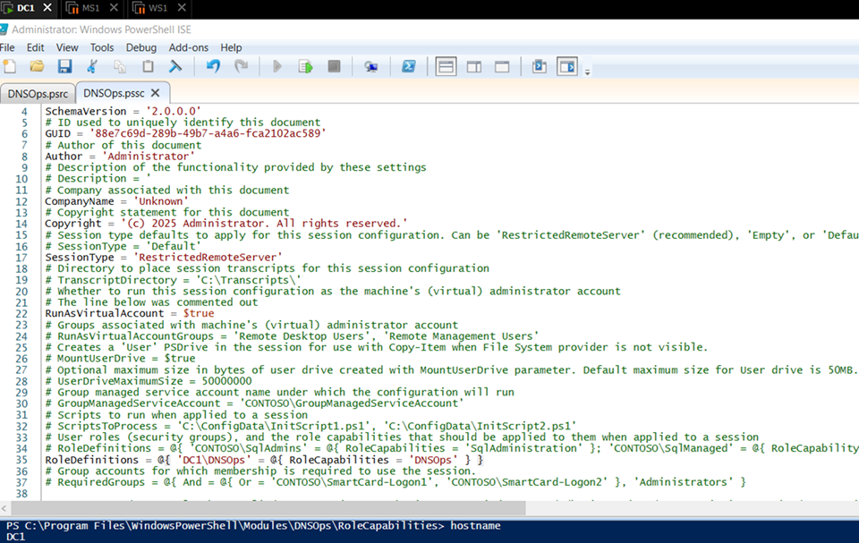

# Just Enough Administration (JEA)
## 1. Introduction

This lab focused on implementing JEA in a Windows Server 2016 environment to demonstrate how administrative privileges can be securely delegated. The exercise was performed within the existing Active Directory domain, using the servers DC1 and WS1.

The goal was to configure PowerShell-based role definitions that allow a specific group to perform only the DNS management tasks required, without granting full administrative access. Through the creation of role capability files, session configuration files, and custom PowerShell endpoints, the lab illustrated how JEA enforces the least privilege principle while maintaining centralized control and traceability of actions.

The configuration and testing process took place across both systems — with DC1 acting as the domain controller and configuration host, and WS1 used to validate the delegated access through remote PowerShell sessions.

## 2. Creating and Configuring Role Capability Files

This stage began on DC1, where the PowerShell module directory was prepared for a new JEA role named DNSOps. Using PowerShell ISE, the Administrator navigated to the system module path and created both the module manifest and the role capability file. These steps established the foundation for defining which commands members of the DNSOps group would be permitted to execute.

After creating the required directories and cd-ing into them, two key files were generated. The first, `DNSOps.psd1`, is the module manifest that defines the metadata and structure of the module. The second, `DNSOps.psrc`, is the role capability file, which specifies the commands and functions available to users under the DNSOps JEA role:

```
New-ModuleManifest .\DNSOps.psd1
```
```

New-PSRoleCapabilityFile -Path .\DNSOps.psrc
```


Once created, the capability file was opened and customized. Under the _#VisibleCmdlets_ section, the Administrator defined the DNS-related cmdlets that users would be allowed to run, such as restarting the DNS service. The _VisibleFunctions_ and _VisibleExternalCommands_ sections were also configured to include DNS management functions.

After editing, the file was saved to finalize the configuration of the _DNSOps.psrc_ capability file.

<p align="center"> <br> <b>Image 1 – Creating / Editing the DNSOps.psrc role capability file in PowerShell ISE</b> </p>

This configuration effectively restricted JEA session users to only the specified DNS-related cmdlets and external commands, preventing any unauthorized administrative actions beyond their assigned role.

## 3. Creating and Configuring Session Configuration Files

Once the role capability file was defined, the next part involved creating a session configuration file to control how the JEA environment would be applied. Working on DC1, the Administrator opened PowerShell ISE and generated a new session configuration file named `DNSOps.pssc` using the `New-PSSessionConfigurationFile -Path .\DNSOps.pssc -Full` command. This file acts as a blueprint that determines which cmdlets, parameters, and functions are allowed when connecting to the JEA endpoint.

In the PowerShell ISE editor, several modifications were made to restrict and secure the session. The line defining the session type was changed from `SessionType = 'Default'` to `SessionType = 'RestrictedRemoteServer'`, limiting command availability. The parameter `RunAsVirtualAccount` was enabled by uncommenting it and setting it to `$true`, ensuring that temporary virtual credentials would be used for elevated tasks. Finally, under the section for role definitions, the DNSOps group was mapped to the DNSOps capability file created earlier, establishing the relationship between the user group and its allowed commands.

After all changes were saved, the configuration effectively tied the DNSOps role capabilities to a restricted PowerShell session for future connections.

<p align="center"> <br> <b>Image 2 – Editing DNSOps.pssc session configuration</b> </p>

